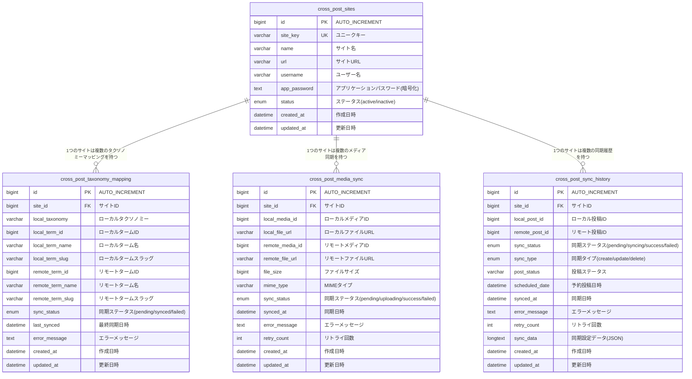

# WP Cross Post プラグインの問題点と対策

## プラグイン概要

WP Cross Postは、WordPressサイト間で記事を同期するプラグインです。カテゴリーとタグの自動同期、マテリアルデザインUI、REST API v2対応を特徴としています。

## 現在の問題点

### 1. WordPressアップデートによる非互換性

WordPressのアップデートにより、以下の機能が影響を受けている可能性があります：

- REST API v2の仕様変更
- アプリケーションパスワード機能の変更
- セキュリティ関連の強化（nonce検証、サニタイズ処理など）

### 2. コードの不完全性

現状のコードには以下の問題があります：

- サイトハンドラークラスの一部メソッドが未実装
- 同期エンジンクラスが最小限の実装のみ
- エラーハンドリングが不十分

## 原因分析

### 1. WordPressバージョンの非互換性

プラグインの要件はWordPress 6.5以上となっていますが、現在のWordPress環境との互換性に問題がある可能性があります。特に以下の点が影響している可能性があります：

- REST APIのエンドポイント変更
- アプリケーションパスワードの認証方式変更
- セキュリティ関連のフックや関数の変更

### 2. PHPバージョンの影響

プラグインはPHP 7.4以上を要件としていますが、現在の環境でPHPのバージョンが異なる場合、非互換性が発生している可能性があります。

## 対策と改善案

### 1. WordPressアップデートへの対応

最新のWordPressバージョンに対応するため、以下の点を確認・修正します：

- REST API v2のエンドポイントとパラメータの確認
- アプリケーションパスワードの認証処理の更新
- セキュリティ関連のフックや関数の更新

### 2. コードの改善

コードの品質と機能性を向上させるため、以下の改善を行います：

- サイトハンドラークラスの未実装メソッドの実装
- 同期エンジンクラスの機能拡充
- エラーハンドリングの強化
- ログ出力機能の充実

### 3. テスト環境の構築

問題の再現と修正の検証のために、以下のテスト環境を構築します：

- 現在のWordPressバージョンでの動作確認環境
- 複数のWordPressバージョンでの互換性テスト環境
- 異なるPHPバージョンでの動作確認環境

## 実装状況

### 完了済みの改善

1. プラグインバージョンの更新（1.1.0）
2. WordPress 6.5への対応
3. アプリケーションパスワード機能の変更に対応
4. REST APIの最新仕様に対応
5. セキュリティ強化（認証処理の改善、SSL接続の強化）
6. バグ修正（WordPressアップデート後の動作不具合、日本語ドメインの処理改善）
7. リファクタリング
   - 認証処理の共通化（WP_Cross_Post_Auth_Managerクラスの作成）
   - 画像処理の共通化（WP_Cross_Post_Image_Managerクラスの作成）
   - Sync_Handlerクラスの分割（WP_Cross_Post_Post_Data_PreparerクラスとWP_Cross_Post_Block_Content_Processorクラスの作成）
   - エラーハンドリングの統一（WP_Cross_Post_Error_Managerクラスの作成）
   - 画像同期処理のリトライロジックの簡略化
   - 依存注入パターンの導入
   - インターフェースの導入検討
   - ログレベルの適切な設定
   - ログ出力内容の詳細化
   - 並列処理の導入検討
   - レート制限対策の共通クラス作成
   - 各クラスでのレート制限対策統一

## データベース設計

### カスタムテーブル構成

プラグインバージョン1.1.0から、従来のwp_optionsテーブルによるデータ管理から、パフォーマンスとスケーラビリティを向上させるカスタムテーブル設計に移行しました。

### ER図

### テーブル詳細仕様

#### 1. cross_post_sites（サイト情報テーブル）
**目的**: 同期先サイトの基本情報を管理

- **主要インデックス**: 
  - PRIMARY KEY (`id`)
  - UNIQUE KEY (`site_key`)
  - INDEX (`status`, `name`)

- **特徴**:
  - app_passwordは暗号化して保存
  - site_keyで重複防止
  - statusによるアクティブ/非アクティブ管理

#### 2. cross_post_taxonomy_mapping（タクソノミーマッピングテーブル）
**目的**: ローカルとリモートサイト間のカテゴリー・タグのマッピング管理

- **主要インデックス**:
  - PRIMARY KEY (`id`)
  - UNIQUE KEY (`site_id`, `local_taxonomy`, `local_term_id`)
  - INDEX (`site_id`, `local_taxonomy`)
  - INDEX (`sync_status`)

- **特徴**:
  - category/post_tagの両方に対応
  - 同期ステータスによる管理
  - エラーメッセージの保存

#### 3. cross_post_media_sync（メディア同期履歴テーブル）
**目的**: 画像・メディアファイルの同期状況管理

- **主要インデックス**:
  - PRIMARY KEY (`id`)
  - UNIQUE KEY (`site_id`, `local_media_id`)
  - INDEX (`sync_status`)
  - INDEX (`remote_media_id`)

- **特徴**:
  - アップロード進行状況の追跡
  - リトライ機能の実装
  - ファイルサイズ・MIMEタイプの記録

#### 4. cross_post_sync_history（投稿同期履歴テーブル）
**目的**: 投稿の同期履歴と設定情報の管理

- **主要インデックス**:
  - PRIMARY KEY (`id`)
  - UNIQUE KEY (`site_id`, `local_post_id`)
  - INDEX (`sync_status`, `sync_type`)
  - INDEX (`scheduled_date`)

- **特徴**:
  - 予約投稿対応
  - JSON形式での詳細設定保存
  - CRUD操作の完全追跡

### パフォーマンス最適化

#### インデックス戦略
- **複合インデックス**: 頻繁にWHERE句で使用される組み合わせ
- **ユニークインデックス**: データ整合性の保証
- **外部キー制約**: 参照整合性の自動管理

#### キャッシュ戦略
- **WordPressオブジェクトキャッシュ**: 頻繁にアクセスするサイト情報
- **トランジェントAPI**: タクソノミー情報の一時キャッシュ
- **キャッシュ無効化**: データ更新時の適切なキャッシュクリア

#### クエリ最適化
- **JOIN最適化**: 関連データの効率的な取得
- **LIMIT/OFFSET**: 大量データのページング対応
- **インデックスヒント**: 複雑なクエリでのパフォーマンス向上

### 従来方式との比較

| 項目 | 従来(wp_options) | 新方式(カスタムテーブル) |
|------|------------------|-------------------------|
| パフォーマンス | オプション数増加で低下 | インデックスで高速化 |
| スケーラビリティ | 制限あり | 数千件対応可能 |
| データ整合性 | 手動管理 | 外部キー制約で自動 |
| 検索性能 | LIKE検索で低速 | インデックス検索で高速 |
| メンテナンス性 | 複雑なパターンマッチ | 構造化されたクエリ |
| バックアップ | 標準WordPressツール | 追加考慮が必要 |

